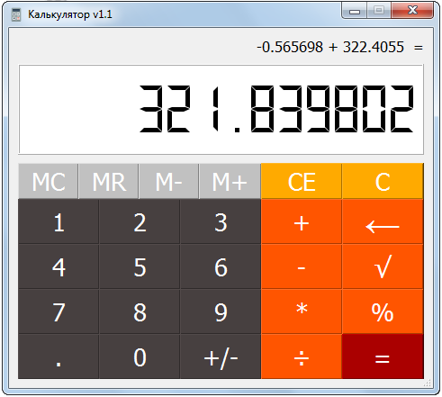
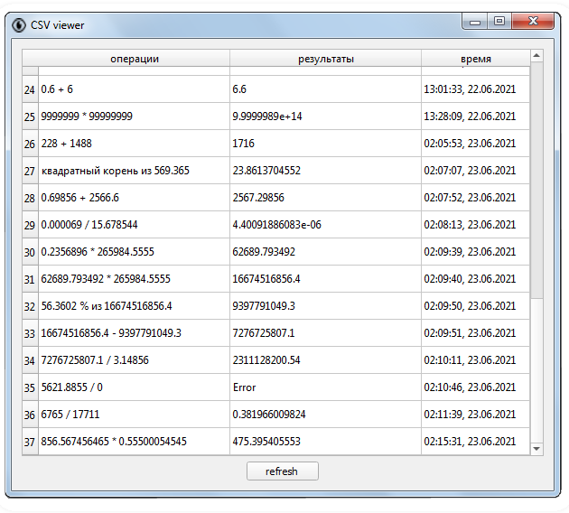
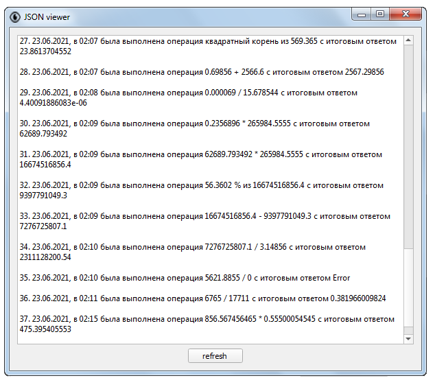
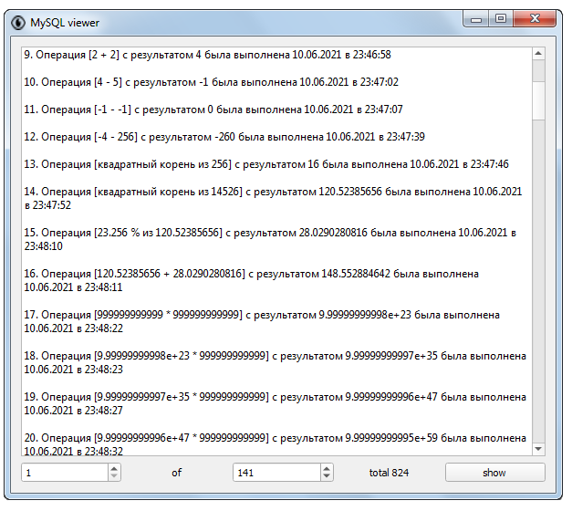

# Accounting calculator with the style of an [Epson PX-8](https://en.wikipedia.org/wiki/Epson_PX-8_Geneva) Vintage Laptop
<br>
Designed for standard accounting calculations.<br>
Gui powered by PyQt5.<br>
# Features:
 - showing the entered operation
 - write calculations results in CSV, JSON, MySQL database
 - 12-digit display
 - arithmetic calculations
 - percentage calculations
 - memory
# For running application:
 * Python 3.8.6
 * [PyQt5](https://pypi.org/project/PyQt5/)
 * [mysql-connector-python](https://pypi.org/project/mysql-connector-python/)
 * [MySQL 8](https://dev.mysql.com/downloads/mysql/)
# How to use:
- ### With writing results:
  - #### if want to use MySQL (optional feature):
    - [get start installing MySQL 8](https://dev.mysql.com/doc/mysql-installation-excerpt/8.0/en/windows-installation.html)
    - create MySQL admin login in root_config.py
      ```python
         config = {'host': '127.0.0.1',
                   'user': 'root',
                   'password': 'randompassword'}
      ```
    - configure and launch scripts:
      - create_database.py (if necessary)
      - create_user.py (if necessary)
      - create_table.py
    - configure the MySQL login and database for use by third-party users in config.py
       ```python
          config = {'host': '127.0.0.1',
                    'user': 'randomname',
                    'password': 'randompassword',
                    'database': 'randomdatabase'}
       ```
  - #### launch main.py
- ### Without writing results:
  - #### launch main_not_write.py
# Additional Resource:
  [MySQL Connector/Python Developer Guide](https://dev.mysql.com/doc/connector-python/en/)
# How to view the results of calculations:
- csv_viewer.py<br>

- json_viewer.py<br>

- mysql_viewer.py<br>

